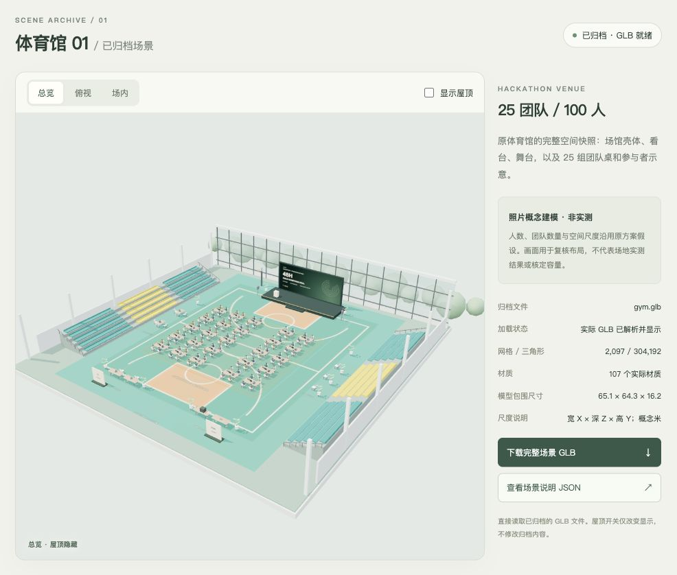
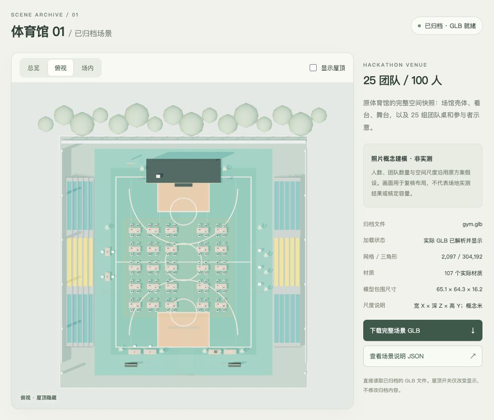
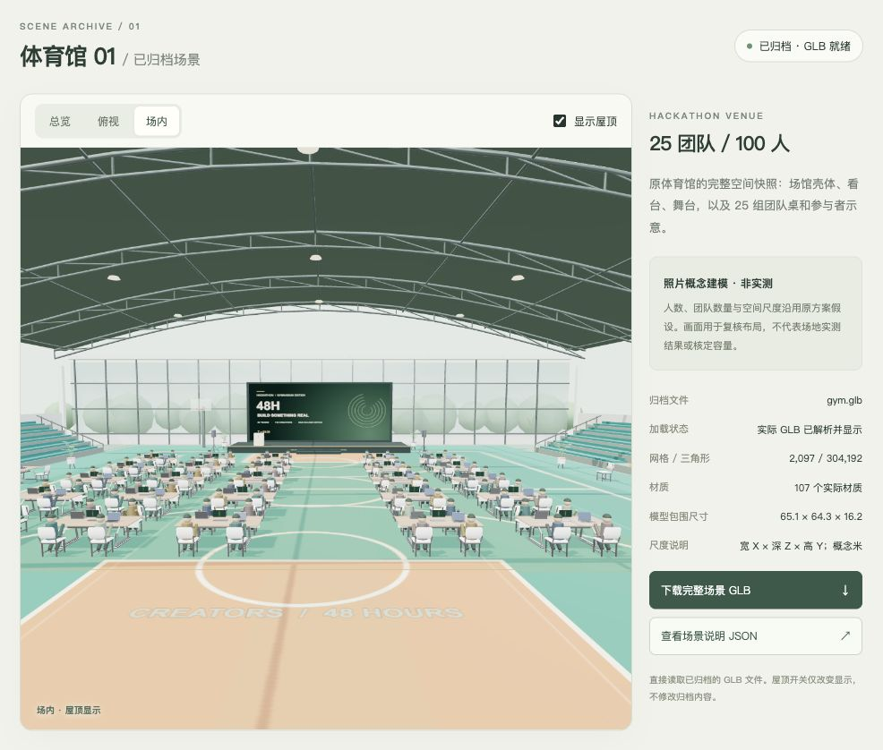

# 场景模板 01：体育馆

这是一份完整体育馆场景的独立归档，包含场馆结构、活动布置、人物及可独立读取的 GLB。

第一版沿用已经完成的体育馆黑客松方案：保留室内场馆、钢构屋顶、两侧看台、篮架、舞台与服务区，布置 25 组四人团队桌和 100 个示意参与者。

## 查看和复用

在本目录运行 `python3 serve.py`，打开 http://127.0.0.1:8770/ 。本机服务需要持续运行。

也可以从仓库根目录运行 `python3 serve.py 8771`，然后打开 `http://127.0.0.1:8771/scene/templates/gym/`。查看模型无需 npm、账号或 API Key；重建并覆盖 GLB 时使用本目录的 `serve.py` 与 `build.html`。

- `gym.glb`：完整场景快照，内含几何、材质与图片纹理，可独立导入支持 GLB 的三维工具。
- `index.html` / `viewer.js`：独立预览器，直接读取 `gym.glb`，支持拖动旋转、缩放、三个视角及屋顶开关。
- `template.json`：场景身份、活动假设、坐标依据、来源与验证记录。
- `previews/`：场景效果图。
- `source-renderer.js` / `assets/`：保留本次快照的生成源代码及家具来源；支持后续修改与重新归档。
- `build.html` / `build-scene.js`：本地重建工具。待五款家具 GLB 加载后，点击保存按钮导出完整场景到本目录。

复用现有外观时直接加载完整 GLB，无需逐件生成。此版是静态场景快照；修改人数或重新排布仍需调整场景源代码，尚未提供正式产品的一键参数化功能。

## 尺度与来源

原体育馆依据用户提供的照片进行概念建模，**没有实测平面尺寸**。文件沿用原模型的坐标与米制约定，模型包围盒不能当作现场测量值。100 人、25 支团队同样是原活动假设。

场馆结构、人物及活动布置来自已有案例的程序建模；桌、椅、笔记本、盆栽与音箱来自已归档的 3DAssets.dev 公开 GLB，原记录许可为 CC0，详细来源见 `ASSET-SOURCES.md`。用户提供的参考照片只作为设计依据，其授权不等同于模型素材的 CC0 许可。

该目录保存既有场景及其导出结果，没有调用图像或三维生成 API，尚未接入正式前后端，也未部署为在线网站。完整场景包含大量网格和场馆结构，不应作为单件物料直接提交给现有物料上传接口。

## 场景预览

