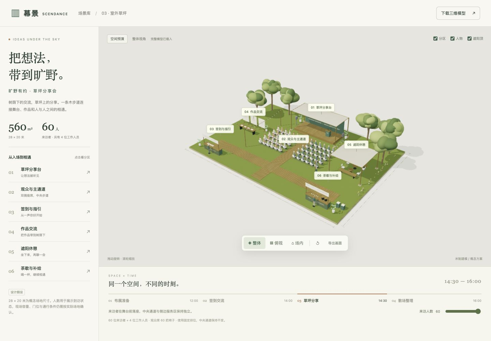
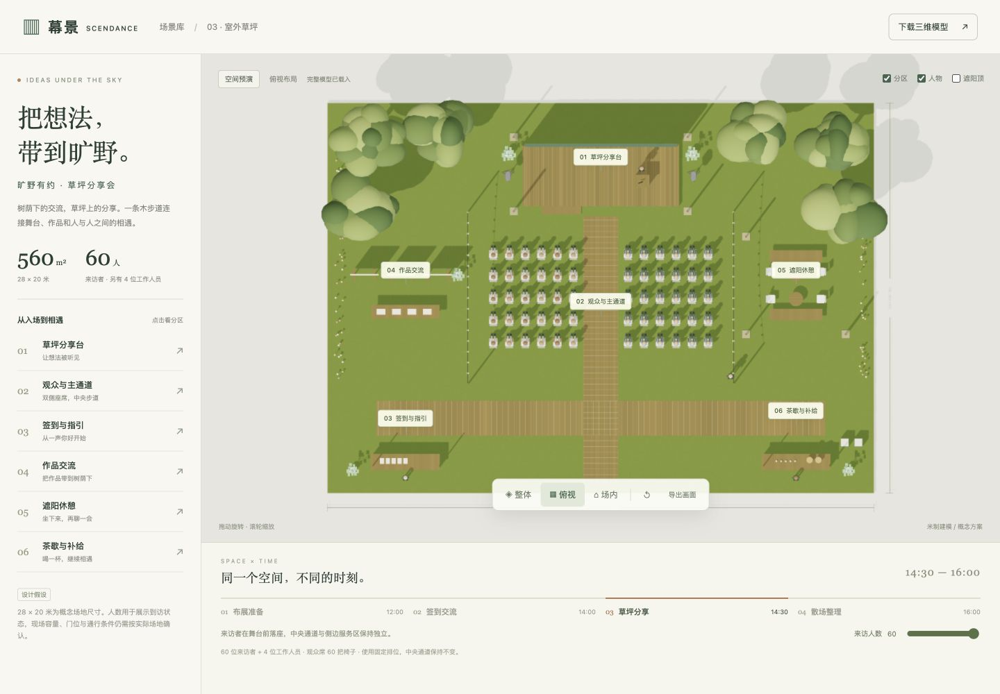
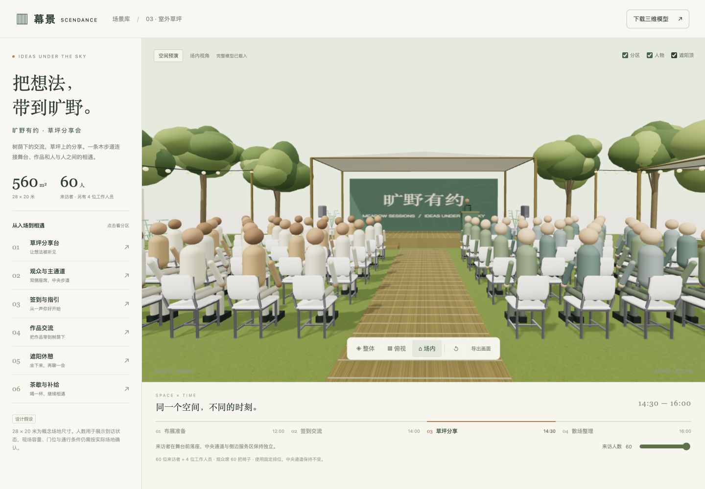

# 场景 03 · 室外草坪「旷野有约」

一套完整的草坪分享会三维概念场景：28 × 20 米、560㎡，默认 60 位来访者、4 位工作人员。包含分享台、观众席、签到、作品交流、遮阳休憩和茶歇六个区域。

## 打开

在本目录运行 `python3 serve.py`，打开 <http://127.0.0.1:8773/>。保持本机服务器运行。也可以从上一级场景库的 HTTP 服务打开 `lawn/`，仅重建保存需要本目录服务器。

查看不需要 npm、账号、API Key 或运行时外部素材下载；需要支持 WebGL 2 的浏览器。不要直接双击 HTML 文件。

## 已实现

- 独立加载 `lawn.glb`，拖动旋转、滚轮缩放；整体、俯视、场内三个视角。
- 分区说明、人物与遮阳顶显示开关，当前画面导出。
- 来访人数 20–60 人：人物数量与观众椅数量一对一联动；另有 4 位工作人员、休息区 4 把椅子及 2 组长凳。
- 观众席使用两侧各 5 排、每排 6 席的固定排位，人数较少时从前排开始保留；这不是任意场地自动排布。中央木步道宽 1.8 米。
- 布展、签到交流、草坪分享、散场四个阶段；在预设位置间切换。草坪分享阶段人物落座，散场光线变暗。这不是连续人流仿真。
- 下载 GLB 是 **60 位来访者、4 位工作人员、60 把观众椅** 的默认快照；网页修改人数不改写下载文件。

## 文件与复用

`lawn.glb` 内嵌贴图，可独立导入三维工具；`model.js` 保留尺寸、固定排位和生成代码，`app.js` 为预览逻辑。`assets/` 保留归档素材和来源，`previews/` 为效果图，`validation/` 为检查记录。

分组包括 `Lawn_Structure`、`Lawn_Furniture`、`Lawn_Seating`、`Lawn_Canopies`、`Lawn_Landscape`、`Lawn_People` 和 `Lawn_Staff`。坐标以米为单位，Y 轴向上。场景包围盒还包括外围尺寸标注和树冠，不等于可用地面面积。

重建时打开 <http://127.0.0.1:8773/?build=1>，素材加载后点击“保存草坪模板”。保存目标固定为本目录的 `lawn.glb`。模型改变后应更新校验与元数据。

## 验证与边界

- glTF 校验结果见 `validation/gltf-validation.json`。
- `validation/check-layout.mjs` 使用预览页面同一人数函数、导出模型的座椅世界坐标边界、主要家具占地和 0.22 米人物示意半径，检查 20–60 人 × 4 阶段共 164 种组合；结果见 `validation/layout-check.json`。
- 浏览器操作、模型独立加载、人数与座椅联动、手机显示记录见 `validation/browser-validation.json`。

尺寸与人数是本示例的设计假设，未使用实测场地；未验证地面坡度、临时搭建、天气、详细身体接触、排队过程或现场容量。当前未接入正式网站编辑器、后端生成接口或云端物料登记。

建筑、树木、展板、人物与画面为程序建模。椅子、盆栽、音箱来自已有 CC0 归档，来源和哈希见 [ASSET-SOURCES.md](ASSET-SOURCES.md)。未调用图像或三维生成 API。

