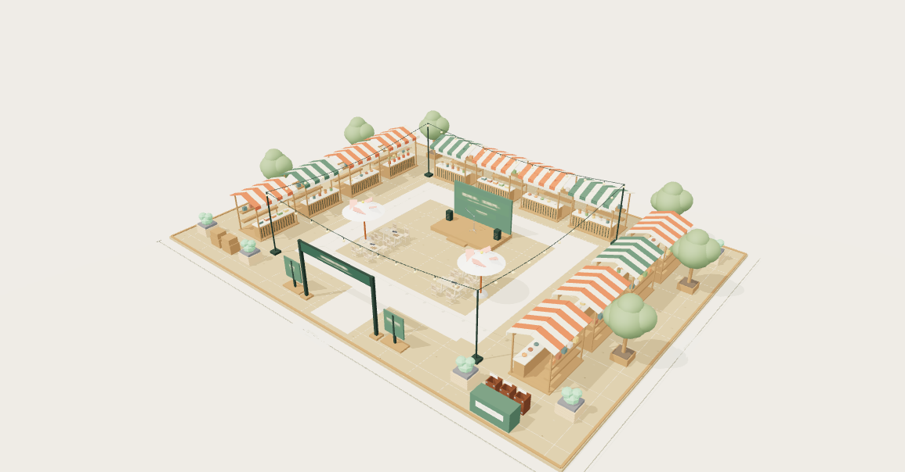
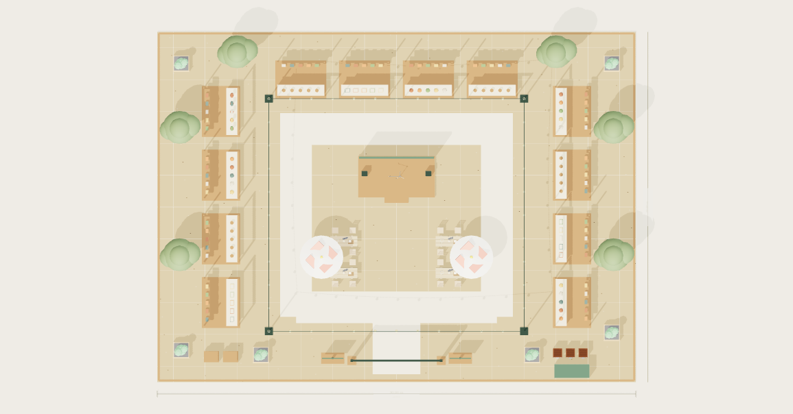
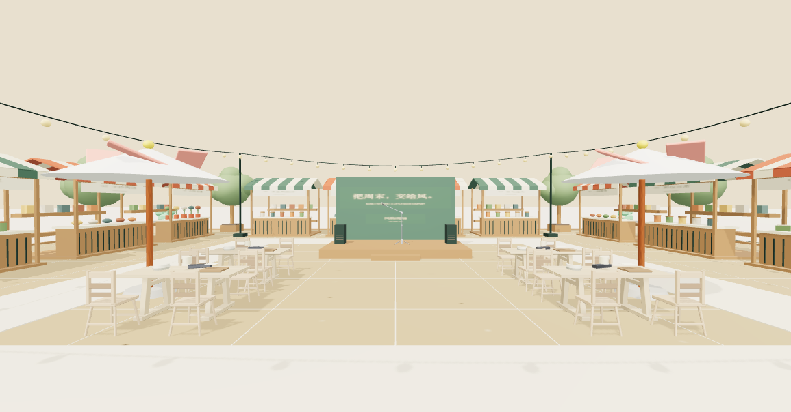

# 风物市集 · 户外市集完整场景

Scendance 独立三维场景模板，30 × 22 米（660㎡），12 个摊位，不包含人物模型。场地尺寸是设计假设，未使用实测场地图，也不表示法定容量。

## 打开

在本目录运行：

```sh
python3 serve.py
```

打开 <http://127.0.0.1:8774/>。服务器仅监听本机，不影响已有的 8770–8773 服务。也可把本目录交给任意静态 HTTP 服务器；需支持 WebGL 2 的浏览器。直接双击 HTML 无法读取本地 GLB。

页面默认直接加载 `market.glb`，无需账号、API Key、构建工具或外部素材请求。模型中的纹理全部内嵌。将 `market.glb` 单独复制出去，也可导入支持 glTF 2.0 的三维工具。

## 场景内容

- 入口门头、双侧导览牌、30 × 22 米场地与米制标注。
- 12 个 3.2 × 2.4 米摊位：两侧各 4 个、北侧 4 个；含条纹棚顶、商品、柜台和货架。
- 2 米宽矩形主环线与 3 米宽入口通道；摊前停留带位于环线外侧。
- 4 张餐桌、16 把座椅、2 把遮阳伞；6 座树池与 6 盆绿植。
- 4.8 × 2.6 米小舞台、背景、麦克风、音箱；分类回收桶、后勤柜与补货箱。
- 独立分组的棚顶、顶部灯串、家具、装饰、摊位与场地。

提供整体、俯视、场内三种视角；拖动旋转、滚轮/双指缩放；分区、棚顶开关；当前画面导出及完整 GLB、ZIP 下载。

## 四个阶段

| 阶段 | 设定时段 | 实际变化 |
|---|---|---|
| 布展准备 | 08:00—10:00 | 晨间光照预设 |
| 开市慢逛 | 10:00—17:00 | 日间光照预设 |
| 傍晚小聚 | 17:00—19:00 | 暖色斜照与亮起的灯串 |
| 收摊整理 | 19:00—20:00 | 较低亮度的基础照明 |

四阶段是光照预设。模型没有来访者或摊主；摊位、桌椅和物料数量保持固定，不模拟摆摊、撤摊或人流。下载的 `market.glb` 是固定完整空间，网页光照与显示开关不会改写下载文件。阶段逻辑保存在 `app.js` 和 `model.js`，不作为 GLB 动画导出。

## 构建与归档

打开 <http://127.0.0.1:8774/?build=1>，点击“保存完整市集模型”可用六种本地素材及程序建模重新生成 GLB。专用服务器只允许写入固定模型、效果图目标。默认预览仅需静态文件服务，归档操作需要本包 `serve.py`。

`model.js` 包含模型尺寸、摊位坐标、预留通道、主要物料占用和生成代码。`Market_*` 分组分别管理场地、摊位、家具、灯串、装饰和棚顶。单位为米，Y 轴向上；整体包围盒包括场外尺寸标注，大于 30 × 22 米有效场地。

## 验证与适用范围

验证结果见 `validation/`：glTF Validator 格式检查、模型数量/包围盒、主要家具占用、场地边界/通道检查，以及桌面/手机浏览器截图。布局检查使用主要物料的水平包围矩形，并独立读取 GLB 顶点和节点变换核对实际边界。舞台与台阶的 2 厘米连接重叠已注明；尺寸标注在场地外侧。

这些检查仅针对本概念模型的几何布局与功能，未验证消防疏散、天气、棚架结构、配重、供电、食品经营或现场执行条件。尚未接入正式前端、后端或线上素材登记；本任务只交付本地独立模板。

## 来源

六种原始素材来自已归档的 3DAssets.dev CC0 模型，文件哈希与原归档相符。Three.js 为 MIT。场地、摊位、商品与图形为程序建模；未调用付费图像或三维生成 API。来源和许可说明见 [ASSET-SOURCES.md](ASSET-SOURCES.md)、[LICENSE.md](LICENSE.md)。

## 效果图







原始画布 PNG 另存于 `renders/`。本机可用 `/?archive=1` 显示归档按钮，普通预览不显示构建与归档控件。

## 复跑模型验证

安装有 Node.js 时，在本目录运行 `node validation/validate-model.cjs`。校验工具已经随包提供，不需要联网安装依赖；普通预览只需要 Python 3。
