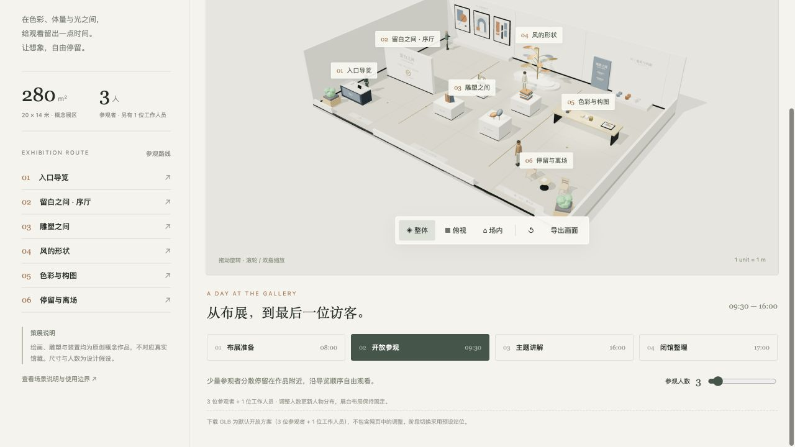
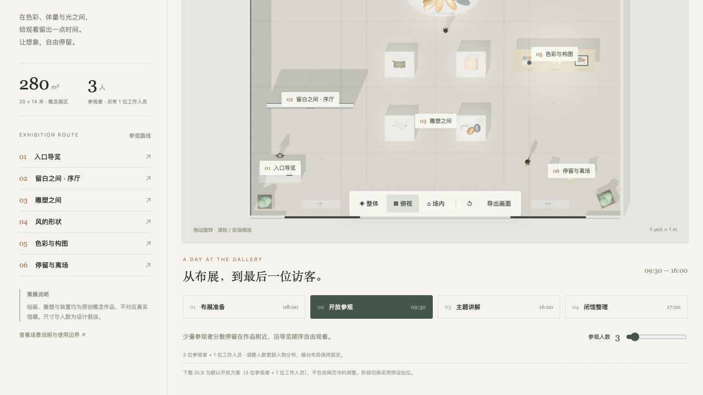
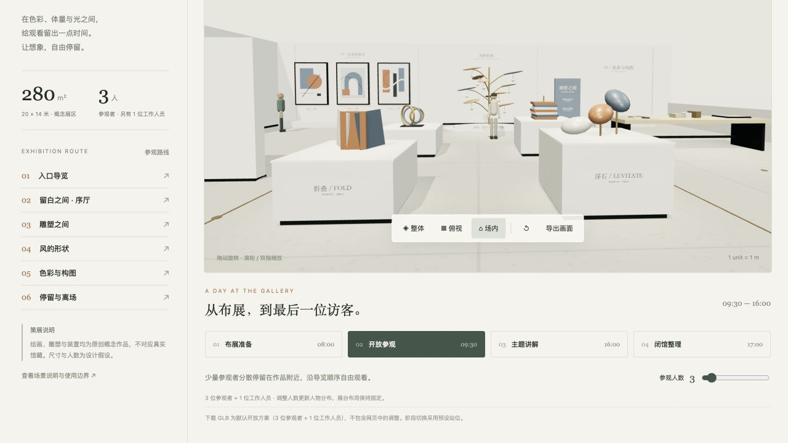

# 留白之间 · 当代美术馆

Scendance 完整场景库的当代美术馆概念展区。20 × 14 米、280 平方米，默认开放状态含 3 位参观者和 1 位工作人员。建筑、展陈、人物与展签一起保存在独立的 `museum.glb` 中，可以导入支持 glTF 2.0 / GLB 的三维软件继续编辑。

以“留白之间 / THE SPACE BETWEEN”为策展主题，暖白展墙、浅灰石材与留白空间容纳原创抽象绘画、开放雕塑展台和铜制抽象装置“风的形状”。作品及展签内容为此场景原创的虚构概念，不对应真实艺术家或馆藏。

## 打开预览

有 Python 3 时，在本目录运行：

```sh
python3 serve.py
```

然后打开 [本地美术馆预览](http://127.0.0.1:8775/)。服务仅监听本机 `127.0.0.1:8775`。若这个端口已运行本预览，直接打开即可。模型、页面、字体回退和 Three.js 代码均在包内，预览不需登录或外部 API。浏览器需要支持 WebGL。由于浏览器对本地模块的限制，请通过这个 HTTP 地址访问，不要直接双击 `index.html`。

独立包为 `museum-template.zip`，解压后的 `museum/` 文件夹保留相同结构。无需原项目的前端或后端。

## 场景与操作

完整布局包含入口导览、主题序厅、四座开放白色雕塑展台、墙面抽象绘画、中央艺术装置、艺术创作体验区、休息与离场。网页左侧列出六个参观分区，点击可读对应说明。

| 操作 | 实际效果 |
|---|---|
| 整体 / 俯视 / 场内 | 切换相机观察位置；俯视为正交投影，场内为参观者高度的透视视角。 |
| 拖动、滚轮 / 双指 | 整体与场内可旋转和缩放，俯视可平移、缩放。 |
| 分区 / 人物 / 外墙 / 顶部灯架 | 显示或隐藏相应内容，方便检查内部布局。外墙开关控制周边建筑墙体，独立序墙和墙面作品保留。灯架默认在网页中隐藏，完整 GLB 中保留。 |
| 0–36 位参观者 | 显示相应数量的预设人物。默认 3 位，另有 1 位工作人员。初始只创建默认人物，增加人数时才按需创建额外访客。设为 0 时仅保留工作人员，关闭“人物”可隐藏全部人物。展台与家具不会自动重排。 |
| 布展 / 开放 / 讲解 / 闭馆 | 使用预设时段、人员可见性与站位；闭馆同时调暗网页照明。 |
| 导出画面 | 下载当前三维画面的 PNG，不含网页侧栏与说明文字。 |
| 下载完整 GLB | 下载固定默认开放方案：3 位参观者 + 1 位工作人员，含完整展墙和灯架。网页中的人数、阶段、显隐及相机调整不写入该下载文件。 |

阶段切换是流程演示，人物站位由代码明确指定。它没有实时人流模拟、避障寻路、AI 自动规划或家具联动排布功能。布展和闭馆阶段不显示访客，仍保留一位工作人员；滑块保留的是开放 / 讲解阶段人数设定。艺术创作体验区呈现实体空间和静态示例内容，不提供在线绘画或实际交互设备功能。

GLB 使用米作为单位、Y 轴向上。主要节点分组为：`Museum_Architecture`、`Museum_Exhibition`、`Museum_Lighting`、`Museum_Visitors`、`Museum_Staff`。展墙与顶部灯架有单独子组，便于在导入工具中控制显示。完整 GLB 内嵌纹理，并通过 `KHR_lights_punctual` 保留 6 个真实聚光灯；网页额外提供的环境光、背景及相机不保证在第三方软件中自动复现，导入后的渲染效果取决于软件设置。

## 文件说明

| 文件 | 用途 |
|---|---|
| `museum.glb` | 可独立导入的完整默认三维场景。 |
| `index.html`、`app.js`、`style.css` | 独立加载 GLB 的交互预览。 |
| `model.js` | 建筑、作品、人物、贴图和预设站位的构建源码。 |
| `assets/models/`、`assets/catalogue.json` | 原始道具 GLB、来源、归档许可和 SHA-256。 |
| `vendor/three/` | 本地 Three.js 及插件、MIT 许可。 |
| `previews/` | 整体、俯视、场内截图。 |
| `validation/` | 格式、模型数量、空间占用及浏览器检查记录。 |
| `template.json` | 场景元数据、能力边界、文件引用与验证摘要。 |
| `ASSET-SOURCES.md` | 原创内容和第三方道具来源说明。 |

## 修改与重新导出

编辑 `model.js` 后，在本地服务运行时打开 [构建预览](http://127.0.0.1:8775/?build=1)。该模式从源码生成三维场景；点击底部保存模板按钮会重写同目录的 `museum.glb`。建议先复制当前模型留作旧版本。

保存始终导出默认开放方案（3 位参观者、1 位工作人员、完整展墙和灯架），不会将当前滑块或阶段状态作为新的默认值。正常预览页面直接加载已保存的 GLB；要验证重建后的独立加载结果，返回不带 `?build=1` 的地址刷新。

重新导出后，可在原工作区运行格式与几何检查：

```sh
node scene-template-library/museum/validation/validate.mjs
```

该脚本使用原工作区已存在的 `scendance-frontend/node_modules/gltf-validator`。如果独立移动了文件夹，可把环境变量 `GLTF_VALIDATOR_MODULE` 指向已有 `gltf-validator` 包目录，或在 Node 可解析的位置提供该包。格式验证工具不是打开预览的依赖。检查记录会写回 `validation/gltf-validation.json` 与 `validation/model-inspection.json`。

## 验证范围与使用边界


格式检查覆盖 GLB 头部、Khronos glTF Validator 错误与警告、外部资源引用、纹理内嵌、节点分组、默认人数、网格 / 三角形数、世界包围盒。空间检查使用人物代理圆、声明的家具矩形和概念场地边界；旋转网格的包围盒可能比真实几何宽。浏览器检查记录分别说明相机、缩放旋转、阶段人数、手机布局与控制台的实际测试结果。

280 平方米、人数与摆放均为概念设计假设，未经现场测量，不能作为法定容量、消防疏散、无障碍、结构承重、照度或其他法规符合性的证明。该版本为本地完整场景模板，当前仍沿用 `museum/` 目录及 `museum.glb` 文件名，以保持库内路径兼容。尚未接入正式 Scendance 网站、素材选择器或后端，也未自动提交、合并或部署。

## 本次交付验证结果

2026-10-03 重新导出的稀疏人物模型实测为 **3 位参观者 + 1 位工作人员**，保留 6 个真实聚光灯。GLB 为 2,430,960 字节（约 2.32 MiB），含 329 个节点、284 个网格实例、27,558 个三角形实例。30 张图片全部内嵌，无外部资源引用。

Khronos glTF Validator 校验为 **0 错误、0 警告**，另有 279 条信息级提示（未使用属性、灯光目标空节点、非二次幂图片尺寸），完整保留在 `validation/gltf-validation.json`。默认 4 个人物对声明的 16 个家具占位进行静态代理检查，未发现相交、越界或人物重叠。

新版本浏览器实测与阶段检查结果以 `validation/browser-validation.json` 和 `validation/phase-layout-check.json` 为准；旧版测试数据不作为本次版本的验收依据。






