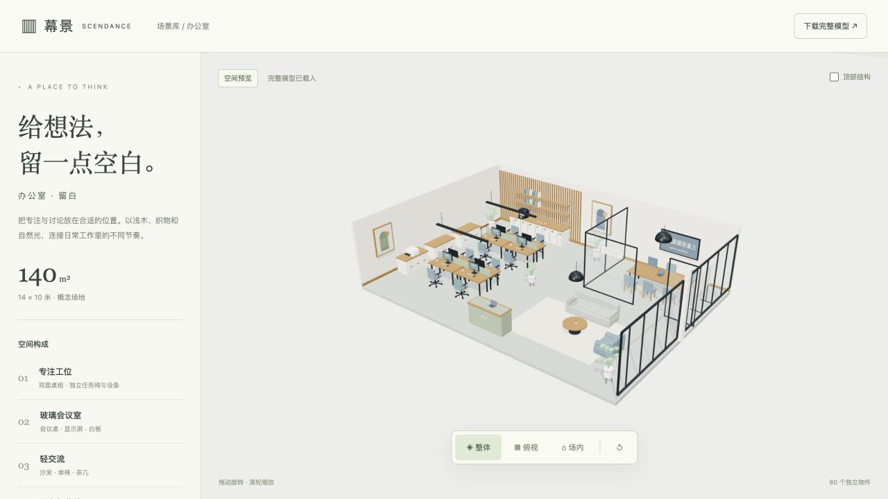
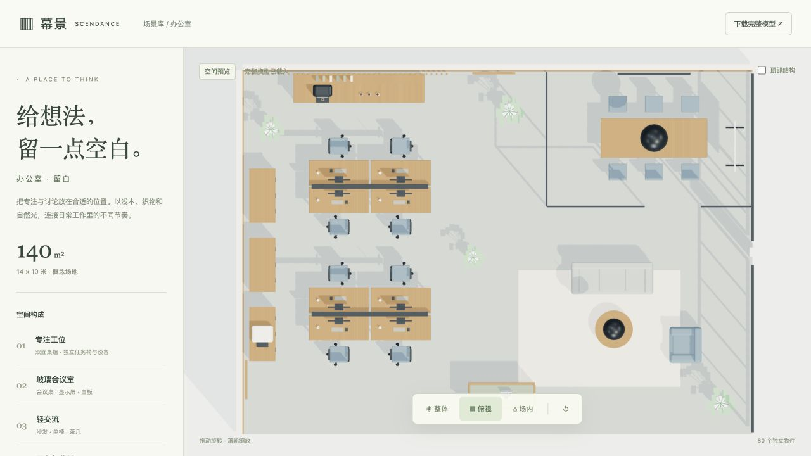
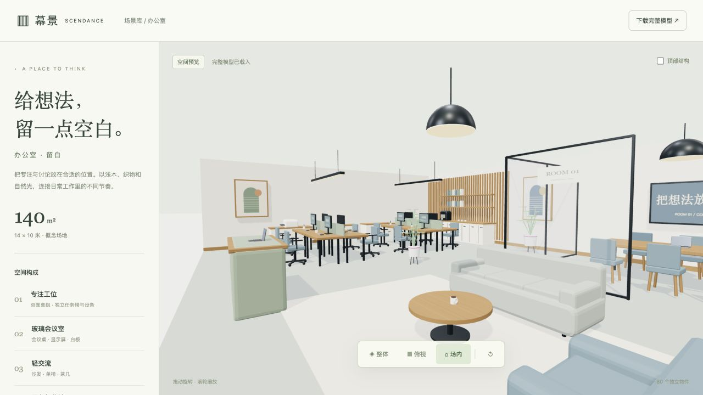

# 办公室 · 留白

完整、无人、静态的办公室概念场景，包含双面工位、玻璃会议室、入口接待、休闲交流及茶水收纳。场地设定为 **14 × 10 米，140㎡，设计层高 3.3 米**，不是用户现场照片的还原或实测数据，也不代表核定人数。

## 本地预览

在本目录运行：

```sh
python3 serve.py
```

打开 <http://127.0.0.1:8777/>，保持服务器运行。支持旋转、缩放、整体/俯视/场内三个视角及顶部结构开关。直接读取 `office.glb`，不需要账号、API Key、npm 或运行时外部资源；需要支持 WebGL 2 的浏览器，不可直接双击 HTML。

ZIP 解压后，在 `office/` 目录执行相同命令。当前模型和页面仅在本地交付，未上传 GitHub、未合并 main、未部署在线网站。

## 模型与分组

格式是 glTF 2.0 binary，贴图内嵌，单位为米、Y 轴向上。根节点为 `Office_CreativeWorkspace_14x10`，局部原点位于地面中心。家具从地面向上建立，根节点保持单位缩放。

| 分组 | 内容 |
| --- | --- |
| `Office_Structure` | 地板、墙面、窗框、玻璃隔断和墙面装饰 |
| `Office_Furniture` | 桌椅、沙发、柜体、接待台和植物 |
| `Office_Equipment` | 显示器、笔记本、咖啡机、打印机、白板和文具 |
| `Office_Lighting` | 吊灯与线性灯具的几何和发光材质 |
| `Office_Roof` | 顶板与顶面灯带；预览默认隐藏，GLB 保留完整分组 |

家具、设备等可独立操作的物件以 `Office_<类型>_<三位编号>` 命名，并在节点 `userData` 中记录 `editableObject`、`role`、`source`。模型保留 80 个独立物件节点，没有将整场景焊接成单一网格。每个物件内部可以包含多个网格与共享材质。

物料示例为 8 张工作桌、8 把任务椅、1 张会议桌、6 把会议椅，以及沙发、单椅、茶几等；这是模型内容清单，不是人数或空间容量承诺。准确统计、文件大小与 SHA256 见 `template.json` 和 `validation/model-validation.json`。

## 前后端对接约定

预期入库位置为 `scene/templates/office/`，完整模型路径为 `/scene/templates/office/office.glb`。这是**未来统一入库路径**，当前未推送。开发时可从本目录 HTTP 服务使用 `./office.glb`。

```js
const gltf = await new GLTFLoader().loadAsync('/scene/templates/office/office.glb');
const office = gltf.scene.getObjectByName('Office_CreativeWorkspace_14x10');
const desk = office.getObjectByName('Office_WorkDesk_001');
scene.add(office);
// 后续编辑器可以对 desk 这个整体进行平移、旋转等操作。
```

1. `template.json` 延用 `schemaVersion: 1`、`kind: complete-scene-template`，属于场景归档清单，不替代业务后端的 Scene schema。
2. 加载后保持米制坐标和物件层级，不将整场景重新归一化为“一件家具”的尺寸。若需提取单物件，先处理其父级变换。
3. 独立命名节点提供后续编辑入口，但本预览只实现浏览与视角操作。正式幕景编辑器的选中、移动、保存、重开与后端登记尚未接入或验证。
4. 当前下载返回固定的完整 GLB；预览中的视角或顶部显示开关不改写文件。
5. 完整场景包含建筑、装饰与多件物料，不能把它当成已符合现有单件物料上传接口的模型直接提交。适配全场景导入需另外完成接口与复杂度检查。
6. GLB 保存灯具几何与发光材质。环境光、主光和色调映射由 `app.js` 提供；导入其他软件时需由目标渲染器配置照明。

## 源码与重建

- `model.js`：办公室布局、家具设备和分组。
- `scene-kit.js`：本目录独立保存的几何、材质及导出工具。
- `config.js`：尺寸、名称和预设视角。
- `assets/`：原始复用模型与来源清单。
- `previews/`：整体、俯视、场内截图。
- `validation/`：格式、独立节点、边界和浏览器验证记录。

使用本目录服务器打开 <http://127.0.0.1:8777/?build=1>，成功加载后点击“保存办公室模型”，只覆盖本目录的 `office.glb`。源码修改后应重新导出并更新校验、manifest、截图和 ZIP。

## 验证范围

已使用实际导出的 GLB 验证 glTF 格式、内嵌贴图、独立节点和命名、物件世界坐标边界，并在浏览器检查独立加载、三视角、旋转缩放、顶部开关和手机显示。结果见 `validation/`，glTF 报告中的 informational 提示不等于错误。

这不是现场施工图；未做完整家具两两碰撞、动态操作净距或建筑规范验证。没有人数滑块、活动阶段、人流仿真或生成 API。

重跑格式与边界检查需要 Node.js 和 gltf-validator，可设置 `GLTF_VALIDATOR_PATH` 指向已安装模块，再运行 `node validation/validate.mjs`。查看页面不需要这些依赖。

素材来源与许可见 [ASSET-SOURCES.md](ASSET-SOURCES.md)。




