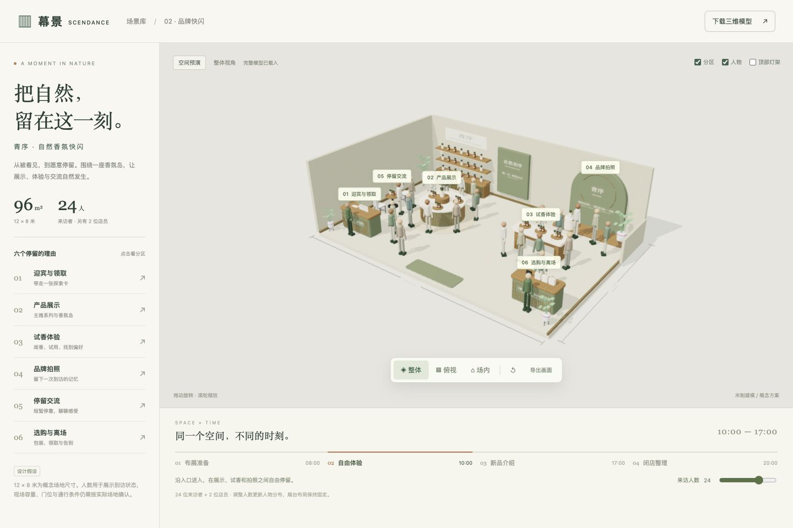
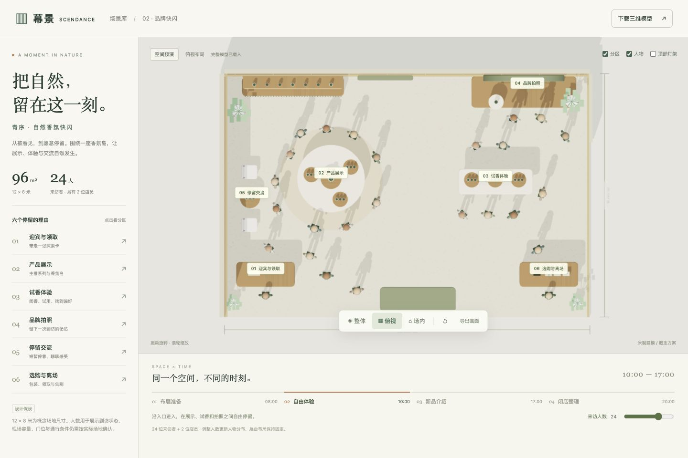
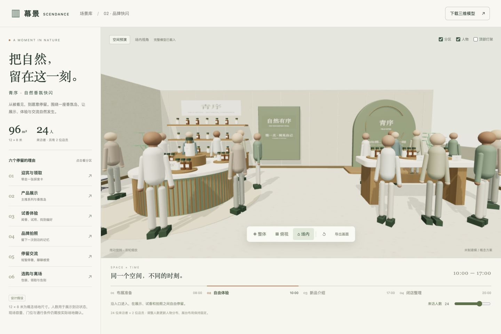

# 快闪 02 · 青序自然香氛

一套独立的品牌快闪概念场景。设计假设为 12 × 8 米、96㎡；默认 24 位来访者，另有 2 位店员。品牌名和陈列产品是本示例的虚构设计。

## 打开

在本目录运行 `python3 serve.py`，打开 `http://127.0.0.1:8772/`。预览直接读取 `popup.glb`，不需要账号、API Key 或运行时外部素材下载。需支持 WebGL 2 的浏览器；不能双击 HTML 文件直接运行。

也可以从仓库根目录运行 `python3 serve.py 8771`，打开 `http://127.0.0.1:8771/scene/templates/`，在同一入口选择体育馆或快闪。重建模型时使用本目录的独立服务器。

## 已实现

- 完整空间：迎宾台、后墙陈列与香氛岛、试香台、圆拱拍照装置、两座交流区、包装结账台、绿植和顶部灯架。
- 总览、正交俯视和入口场内视角；拖动旋转，滚轮或双指缩放。
- 分区说明、人物及顶部灯架显示开关。
- 8–30 位来访者的数量调整，另有 2 位店员；各阶段使用预设人物位置。
- 布展、自由体验、新品介绍、闭店四个阶段；更新人物分布与灯光。属于流程预演，不是连续人流仿真。
- 导出当前画面；下载完整 GLB。GLB 固定为 24 位来访者、2 位店员的默认方案；网页里改变人数或阶段不会改变下载文件。

## 布局与尺度

地板为 12 × 8 米，场景以米为单位、Y 轴向上。模型整体包围盒还包括墙厚、尺寸线与标注，不等于可用面积。尺寸均为本示例的设计假设，未使用任何实测平面图。

物料、场馆结构、人物、店员和灯架保留独立分组，便于后续拆分复用。当前调整人数只增减和移动人物，**不会增减展台、重新计算动线或选择网站物料库中的商品**。尚未接入正式前端、后端生成接口或云端资产登记。

没有实测入口、消防条件、库存及电力数据，不能据此承诺场地容量或直接施工。布局检查只检验概念站位与主要家具的几何占用，并明确记录检查范围。

## 文件与重建

- `popup.glb`：完整模型，纹理内嵌，可独立导入其他 glTF 工具。
- `index.html`、`app.js`、`style.css`：交互预览页面。
- `model.js`：尺寸、结构、展台、产品和示意人物的生成代码。
- `template.json`：场景身份、功能、尺寸假设、资源与校验摘要。
- `assets/`：已归档的原始座椅、盆栽 GLB 及其来源。
- `previews/`：总览、俯视和场内效果图。
- `validation/`：模型格式、阶段站位及浏览器操作验证记录。

重建时打开 `http://127.0.0.1:8772/?build=1`，待素材就绪后点击“保存快闪模板”。仅本机服务器提供这个保存接口，目标固定为此模板的 `popup.glb`。

## 来源

建筑、展台、产品、人物与品牌画面为程序建模。盆栽和座椅复用已有的 3DAssets.dev 模型，归档来源记录为 CC0；Three.js 为 MIT。详细来源及文件哈希见 [ASSET-SOURCES.md](ASSET-SOURCES.md)。未调用图像或三维生成 API。

